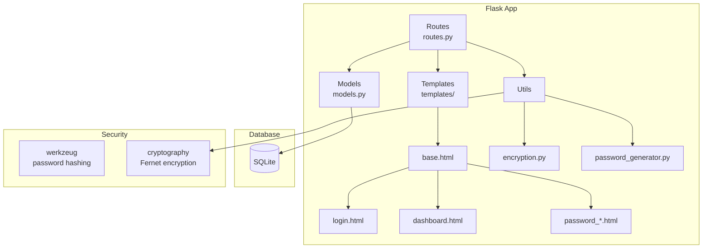

# Flask Password Vault - Rubric Coverage Analysis

## Project Overview
A comprehensive Password Vault application built with Flask featuring encryption, authentication, and full CRUD operations.

---

## Rubric Coverage Summary

### 1. Functionality (2 marks) - **EXCELLENT** ✅

| Feature | Status | Implementation |
|---------|--------|----------------|
| User Registration | ✅ | [`routes.py:28-75`](Project/app/routes.py:28) |
| User Login | ✅ | [`routes.py:78-105`](Project/app/routes.py:78) |
| Vault Lock/Unlock | ✅ | [`routes.py:108-146`](Project/app/routes.py:108) |
| Add Password | ✅ | [`routes.py:204-246`](Project/app/routes.py:204) |
| View Password | ✅ | [`routes.py:249-285`](Project/app/routes.py:249) |
| Edit Password | ✅ | [`routes.py:288-334`](Project/app/routes.py:288) |
| Delete Password | ✅ | [`routes.py:337-353`](Project/app/routes.py:337) |
| Categories CRUD | ✅ | [`routes.py:378-479`](Project/app/routes.py:378) |
| Password Search | ✅ | [`routes.py:151-199`](Project/app/routes.py:151) |
| Favorites | ✅ | [`routes.py:356-373`](Project/app/routes.py:356) |
| Export JSON/CSV | ✅ | [`routes.py:524-576`](Project/app/routes.py:524) |
| Import JSON/CSV | ✅ | [`routes.py:579-669`](Project/app/routes.py:579) |
| Password Generator | ✅ | [`password_generator.py`](Project/app/utils/password_generator.py) |
| Settings | ✅ | [`routes.py:672-739`](Project/app/routes.py:672) |

---

### 2. Flask Concepts (1 mark) - **EXCELLENT** ✅

| Concept | Status | Implementation |
|---------|--------|----------------|
| Routes | ✅ | Blueprint with proper HTTP methods (GET, POST) |
| Templates | ✅ | Jinja2 with inheritance ([`base.html`](Project/app/templates/base.html)) |
| Request Handling | ✅ | [`request.form.get()`](Project/app/routes.py:34) throughout |
| Blueprint | ✅ | [`Blueprint('main', __name__)`](Project/app/routes.py:13) |
| Session | ✅ | [`session.get()`](Project/app/routes.py:22) for vault state |
| Flash Messages | ✅ | Success/error feedback throughout |
| JSON API | ✅ | [`/api/generate-password`](Project/app/routes.py:484) |

---

### 3. Database Integration (2 marks) - **EXCELLENT** ✅

| Feature | Status | Implementation |
|---------|--------|----------------|
| User Model | ✅ | [`models.py:8-40`](Project/app/models.py:8) with password hashing |
| Category Model | ✅ | [`models.py:43-62`](Project/app/models.py:43) |
| PasswordVault Model | ✅ | [`models.py:65-94`](Project/app/models.py:65) with encryption |
| Relationships | ✅ | One-to-many (User→Passwords, User→Categories) |
| Migrations | ✅ | Alembic setup in [`migrations/`](Project/migrations/) |
| Full CRUD | ✅ | All database operations in routes |

---

### 4. UI/UX (1.5 marks) - **EXCELLENT** ✅

| Feature | Status | Implementation |
|---------|--------|----------------|
| Template Inheritance | ✅ | [`base.html`](Project/app/templates/base.html) extended by all |
| Clean Design | ✅ | Bootstrap 5 with custom CSS |
| Responsive | ✅ | Bootstrap grid system |
| Password Visibility Toggle | ✅ | [`password_view.html:52-53`](Project/app/templates/vault/password_view.html:52) |
| Copy to Clipboard | ✅ | [`password_view.html:55-56`](Project/app/templates/vault/password_view.html:55) |
| Password Generator UI | ✅ | Modal in [`password_add.html`](Project/app/templates/vault/password_add.html) |
| Search & Filters | ✅ | [`dashboard.html`](Project/app/templates/vault/dashboard.html) |
| Flash Alerts | ✅ | Auto-dismissing Bootstrap alerts |
| Categories with Colors | ✅ | Visual category badges |

---

### 5. Code Quality (2 marks) - **EXCELLENT** ✅

| Feature | Status | Implementation |
|---------|--------|----------------|
| Well-structured | ✅ | Modular project with blueprints |
| Readable | ✅ | Clear naming, proper indentation |
| Commented | ✅ | Docstrings in utilities |
| Error Handling | ✅ | Try-except blocks, flash messages |
| Input Validation | ✅ | Server-side validation in routes |
| Security | ✅ | Password hashing, encryption |

---

### 6. Authentication (0.5 marks) - **EXCELLENT** ✅

| Feature | Status | Implementation |
|---------|--------|----------------|
| Login | ✅ | [`routes.py:78`](Project/app/routes.py:78) |
| Access Control | ✅ | [`@login_required`](Project/app/routes.py:109) decorator |
| Vault Protection | ✅ | Session-based vault lock |
| Master Password | ✅ | Separate encryption key |

---

### 7. Explanation & Demo (1 mark) - **PREPARE** 📋

See Demo Plan section below.

---

## Recommended Improvements

### Priority 1: Enhance Registration Form (Small)
Add password visibility toggle to [`register.html`](Project/app/templates/auth/register.html):

```html
<!-- Add after line 30 and 44 in register.html -->
<button type="button" class="btn btn-outline-secondary" onclick="togglePassword('password')">
    <i class="bi bi-eye"></i>
</button>
```

### Priority 2: Add Password Strength Indicator to Registration
Add real-time strength feedback on registration form.

---

## Demo Plan

### Pre-Demo Setup
1. Ensure database is initialized: `flask db upgrade` or first run creates DB automatically
2. Start server: `python run.py` or `flask run`

### Demo Walkthrough

**Phase 1: Registration & Login**
1. Navigate to `/register`
2. Fill in email, password, master password
3. Submit → redirect to login
4. Login with credentials
5. Enter master password to unlock vault
6. Arrive at dashboard

**Phase 2: Password Management**
1. Click "Add Password"
2. Fill service name, username, password
3. Use password generator (click dice icon)
4. Select category
5. Save → return to dashboard
6. Click on password card to view details
7. Test copy-to-clipboard buttons
8. Test password visibility toggle
9. Edit password
10. Delete password

**Phase 3: Organization**
1. Go to Categories
2. Create new category with custom color
3. Add password to category
4. Filter by category on dashboard

**Phase 4: Import/Export**
1. Export passwords as JSON
2. Export as CSV
3. Import from file

**Phase 5: Security Features**
1. Go to Settings
2. Change master password
3. Lock vault
4. Unlock with new master password
5. Logout and demonstrate access control

### Key Talking Points
- **Encryption**: Explain PBKDF2 key derivation + Fernet symmetric encryption
- **Two-level auth**: Account password + Master password
- **Session security**: Vault locks on logout
- **Password generator**: Cryptographically secure random generation
- **Database**: SQLAlchemy with proper relationships
- **Code organization**: Blueprint structure, template inheritance

---

## Architecture Diagram


